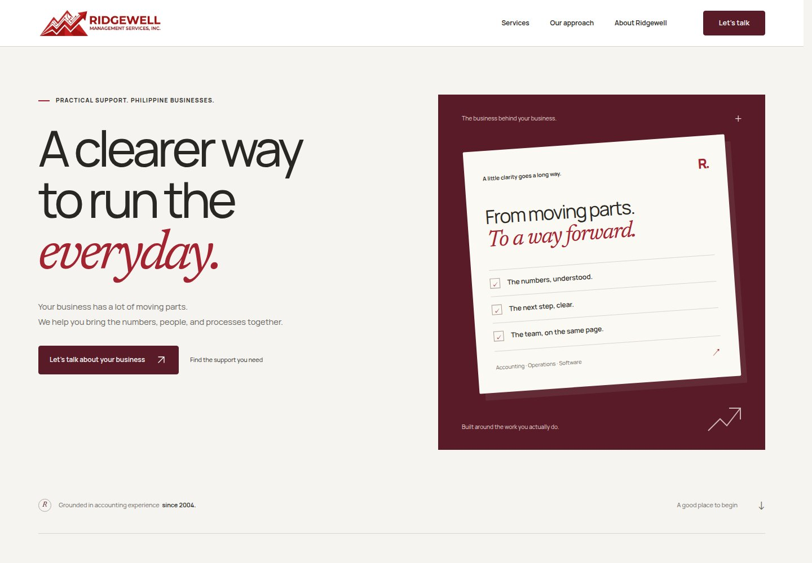

# Ridgewell

A React SPA redesign of [ridgewell.com.ph](https://ridgewell.com.ph) for Ridgewell Management Services, Inc.

The original logo and published service information are retained. The redesign uses a pure white canvas, charcoal typography, Ridgewell red, and original editable SVG illustrations of accounting, operations, and software. A keyboard-accessible service selector, practical FAQs, and a reviewable email-draft inquiry flow support the page.



## Run locally

Requires Node.js 24 (the CI version) and npm.

```sh
npm ci
npm run dev
```

## Verify

```sh
npx playwright install chromium
npm run check
```

`check` runs inquiry unit tests, TypeScript, the production build, and desktop/mobile Playwright tests including axe accessibility checks. Use `PLAYWRIGHT_CHROMIUM_EXECUTABLE_PATH` if your environment provides its own Chromium executable.

## Build and host

```sh
npm run build
npm run preview
```

Upload `dist/` to a static host. Assets use relative paths, and navigation uses real document anchors, so no server-side route rewrites or API server are needed. The production website and its DNS are not changed by this repository.

The GitHub verification workflow builds the app and publishes a downloadable `ridgewell-static-site` artifact. Deploy that artifact to your preferred static host after verification.

## Inquiry behavior

The form validates locally and prepares an email addressed to the address published by Ridgewell. The visitor reviews and sends the message in their own email app, or copies it into webmail. It does not claim a message was sent, connect to the original site's submission API, or save personal data in local storage. A server-backed inquiry form can replace this explicit handoff once its delivery contract is configured.

## Project guide

- `src/content.ts`: services, questions, and published contact address.
- `src/components/`: navigation, service selector, inquiry flow, and original vector artwork in `VectorArt.tsx`.
- `src/lib/inquiry.ts`: validation and email draft construction.
- `src/styles.css`: brand tokens and responsive page styles.
- `DESIGN.md`: design decisions and interaction contract.
- `docs/source-audit.md`: original-site findings and source provenance.
- `docs/verification.md`: final test and anti-slop delivery report.

Original logo rights belong to Ridgewell. Font licenses are supplied by the Fontsource packages in `node_modules`. This repository makes no claim to ownership of the original brand assets.

## Animation

GSAP draws the SVG connections and introduces illustration objects as they enter the viewport. Headings settle by 12px; selecting a service introduces its illustration. Animations respect `prefers-reduced-motion`, including preference changes while the page is open. Motion lives in `src/hooks/useMotion.ts`, with React-scoped cleanup and browser regression coverage in `tests/motion.spec.ts`.
